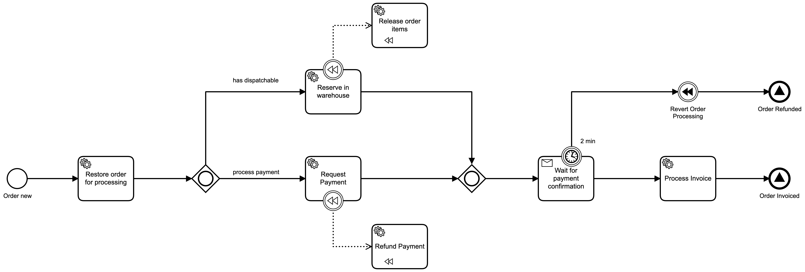

# Dojo: Camunda and test automation
This material was build in order to illustrate how Camunda BPM works and how to implement unit, integration and component tests with Spring Boot.
## About the business process

This is a sample process about Puchase Order processing that is fired as soon as it is received to process the payment and items reservation in Warehouse before the shipping.

Next, you will find example of the camunda process used for the study case:

<p align="center">
  
</p>

### Configuration
In the next table you will find a simple view about de confiugration applyed to each task in the process:

|Task Name|Task Type|Inputs|Outputs|Topic/ Message/ Signal Name|
|----|----|-------|-------|-------|
|Restore order for processing|External Task| order_id|order|order_restore|
|Request Payment|External Task|order|payment_correlation_id|order_payment_request|
|Reserve in warehouse|External Task|order|N/A|order_items_reserve|
|Wait for payment confirmation|Receive Task|payment_correlation_id|N/A|order_payment_confirmation|
|Process Invoice|External Task|order|order, invoice|order_invoice_process|
|Order Invoiced|Signal End Event|N/A|N/A|order_invoiced|  
|Revert Order Processing|Compesation Intermediate Throw Event| N/A | N/A | N/A |
|Release order items|External Task| N/A | N/A | order_items_release |
|Refund Payment|External Task| N/A | N/A | order_payment_refund |
|Order Refunded|Signal End Event| N/A | N/A | order_refunded |

## Required system configuration
TBD

## How to use this project

Start the __docker compose__ file in order to run the __databases__ used by the applications in this project.
```
$ cd ${PROJECT_ROOT}
$ docker-compose up -d
```

Start __Wiremock__ in order to simulate a external service for submiting a payment request.
```
$ cd ${PROJECT_ROOT}/app/wiremock
$ java -jar wiremock-standalone-2.27.2.jar --port 9000 --verbose
```

Start the __camunda process server (ms-process-server)__
```
$ cd ${PROJECT_ROOT}/app/ms-process-server
$ ./mvnw spring-boot:run
```

Start the __purchase order service (ms-order)__
```
$ cd ${PROJECT_ROOT}/app/ms-order
$ ./mvnw test
$ ./mvnw spring-boot:run
```

Connect to MySQL database used by __purchase order service (ms-order)__, in order to create some test data.
```
-- INSERT PRODUCTS
INSERT INTO products (id, sku, amount, is_dispatchable) VALUES (1, 'APPLE-MACBOOKPRO-15-ALUMINIUM', 500, 1);
INSERT INTO products (id, sku, amount, is_dispatchable) VALUES (2, 'MICRO-XBOX-BLACK-SERIESX', 500, 1);

-- INSERT AN ORDER ON THE INITIAL STATE
INSERT INTO purchase_orders (id, status, customer_id) VALUES (1, 'ORDER_NEW', 1);
INSERT INTO purchase_order_items (id, order_id, sku, price, quantity) VALUES (1, 1, 'APPLE-MACBOOKPRO-15-ALUMINIUM', 10.0, 1);
INSERT INTO purchase_order_items (id, ord
```

Connect to Camunda BPM, on ```http://localhost:8080```, using de user and password ```demo``` and deploy the process available on ```${PROJECT_ROOT}/bpm```.

Once the process is successfully deployed, use the next command to create an instance to execute process and follow what is happining through ```Camunda Cockpit```.

```
curl --request POST \
  --url http://localhost:8080/engine-rest/process-definition/key/dojo/start \
  --header 'Content-Type: application/json' \
  --data '{
  "variables": {
    "order_id" : {
        "value" : 1,
        "type": "Long"
    }
  }
}'
```

If you what to simulate the return of a __payment confirmation__ you can use the following command to estimulate the condition.

```
curl --request POST \
  --url http://localhost:8080/engine-rest/message \
  --header 'Content-Type: application/json' \
  --data '{
  "messageName" : "order_payment_confirmation",
  "correlationKeys" : {
    "payment_correlation_id" : {
			"value" : "674e0b0a-8b58-11eb-8dcd-0242ac130003", 
			"type": "String"
		}
  },
  "resultEnabled" : true
}'
```

## License

This project is under the MIT license. See the [LICENSE](./LICENSE) for more information.